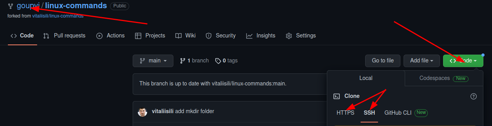
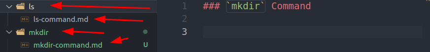
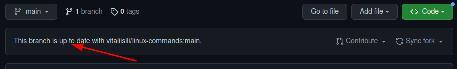
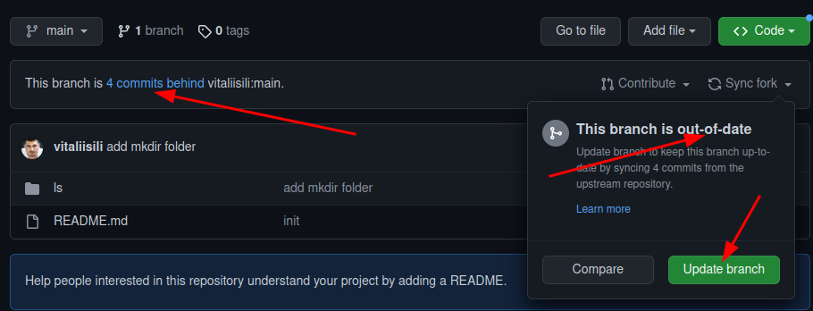
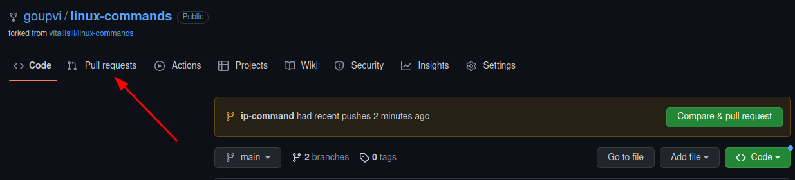
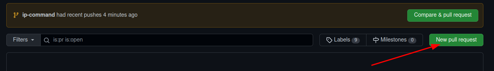
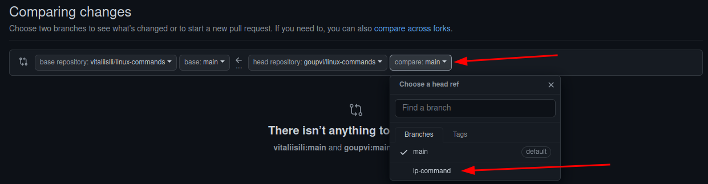
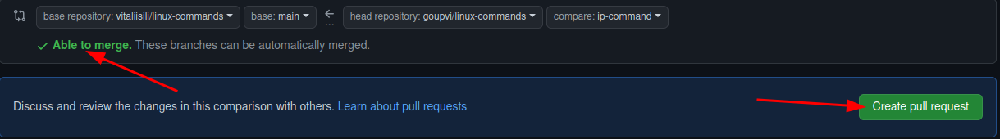
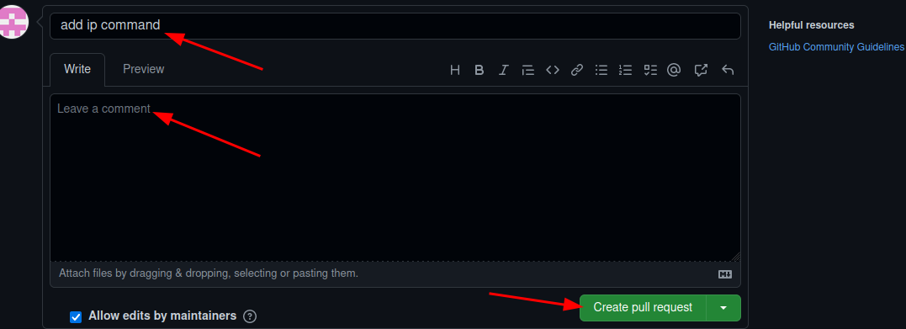

# Linux Commands

* * *

### How to contribute

1. Go to [vitaliisili/linux-commands](https://github.com/vitaliisili/linux-commands) repository
2. Click **Fork button**
   - 
3. Insert repository name, default is "**linux-commands**" and click green button **Create Fork**
4. Check repository and clone to local repository:
   - Check repository name should be `<your-nickname>/linux-commands`
   - Press green button **Code**
   - Choose **HTTPS** or **SSH** and copy the link
   - 

5. Open terminal and go to your work directory
6. Clone repository `git clone <remote-link>`
7. Go to `<project-folder>` example (*linux-commands*) type `cd <project-folder>`
8. Open this folder in your favorite **IDE** example for **Visual Studio Code** type `code .`

* * *
### Project Rules

- Is recommended to create new branch
- For each command create new folder that represent linux command example for `mkdir command` folder should be named "**mkdir**"
- Inside folder create a file with "**md**" extension example "*mkdir-command.md*"
- Project tree example:
- 
- Use "Markdown syntax" to write documentation

* * *

### Create pull request
- Check if remote repository is up to date
- 
- To sync your repository you can set `upstream` **or in your GitHub repository click *`Sync fork`* button and click "Update branch"**
- 
- Update your local repository use command `git pull`
- After you did all changes and your local changes are ready to push type `git push -u origin <branch-name>`
- Create pull request click **Pull request** button
- 
- Click *New pull request* button
- 
- If you create new branch select it from drop down menu
- 
- Check if your changes are able to merge and click **Create pull request** button
- 
- Add pull request title, leave a comment and press **Create pull request**
- 

